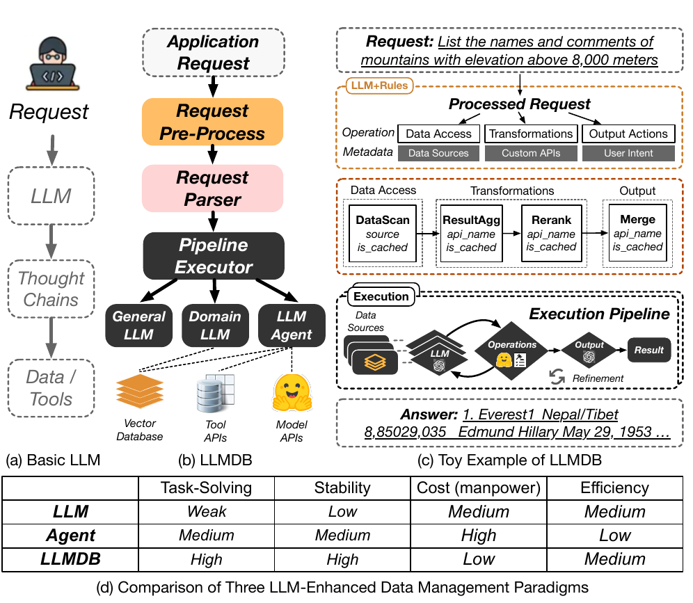

# 04 — Notre proposition : LLMDB

> LLMDB propose trois innovations clés — domain knowledge embedding, vector DB as cache, et pipeline agent — pour dépasser les limites des LLMs seuls et des agents LLM en matière de task-solving, stabilité et coût.

---

## Ce que dit la slide

**Titre :** LLMDB — Un framework LLM-enhanced pour la gestion de données

**Tableau comparatif :**

|                | LLM seul | Agent LLM | **LLMDB** |
|----------------|----------|-----------|-----------|
| Task-Solving   | Moyen    | Moyen     | **Élevé** |
| Stabilité      | Bas      | Moyen     | **Élevé** |
| Coût           | Élevé    | Élevé     | **Bas**   |
| Efficacité     | Moyen    | Bas       | **Moyen** |

**Les 3 idées-forces de LLMDB :**
- **Domain knowledge embedding** → résout l'hallucination (fine-tuning + vector DB)
- **Vector DB as cache** → réduit le coût (on évite d'appeler le LLM quand la réponse est connue)
- **Pipeline agent** → améliore la précision sur tâches complexes (exécution multi-étapes, évaluation, re-génération)

---

## Concepts clés expliqués

### Lecture de la figure 1 : les 3 paradigmes

La figure 1 compare trois architectures de manière schématique :

**(a) LLM seul :** La requête utilisateur est envoyée directement à un LLM général (GPT-4, Claude, etc.). Le LLM génère une réponse en une seule étape. Pas d'accès à des données fraîches, pas de vérification, pas de mémoire. Simple à déployer, mais instable et coûteux à l'échelle.

**(b) Agent LLM :** La requête passe par un agent qui peut appeler des outils (APIs, calculateurs, bases de données). Le LLM orchestre les appels, observe les résultats, et réitère si nécessaire (cf. ReAct, slide 3). Meilleure précision que (a), mais chaque étape appelle le LLM → coût multiplié, et l'agent peut déraper (mauvais choix d'outil, boucle infinie).

**(c) LLMDB :** Architecture hybride avec :
- Un **Domain LLM** spécialisé (moins coûteux à l'appel, moins sujet à l'hallucination sur le domaine)
- Une **Vector Database** qui sert à la fois de mémoire à long terme et de cache sémantique
- Un **Pipeline Agent** structuré avec évaluation explicite à chaque étape


*Figure 1 : Comparaison des trois paradigmes — (a) LLM seul, (b) Agent LLM, (c) LLMDB*

### Analyse ligne par ligne du tableau comparatif

**Task-Solving (capacité à résoudre des tâches de domaine) :**
- LLM seul : *Moyen* — hallucinations fréquentes sur des domaines spécifiques
- Agent LLM : *Moyen* — les outils compensent partiellement, mais l'orchestration reste fragile
- LLMDB : *Élevé* — Domain LLM + Pipeline structuré + vérification formelle à chaque étape

**Stabilité (reproductibilité des résultats) :**
- LLM seul : *Bas* — génération stochastique, pas de vérification
- Agent LLM : *Moyen* — les outils ancrent partiellement la réponse, mais la sélection d'outil peut varier
- LLMDB : *Élevé* — le pipeline est déterministe une fois généré ; la régénération cible uniquement les sous-pipelines défaillants

**Coût :**
- LLM seul : *Élevé* — un appel LLM par requête (General LLM = coûteux)
- Agent LLM : *Élevé* — N appels LLM par requête (N = nombre d'étapes)
- LLMDB : *Bas* — le cache sémantique (Vector DB) évite les appels LLM pour les requêtes similaires ; Domain LLM moins coûteux que General LLM

**Efficacité (latence / débit) :**
- LLM seul : *Moyen* — un seul appel mais le General LLM est lent
- Agent LLM : *Bas* — N appels séquentiels → latence totale = somme des latences
- LLMDB : *Moyen* — la cache sémantique accélère les requêtes répétées, mais le premier calcul reste coûteux

### Cache sémantique : différence avec le cache par clé exacte

**Cache classique (exact key matching) :** Deux requêtes identiques bit à bit retournent le même résultat depuis le cache. Exemples : Redis, Memcached, HTTP Cache-Control.

```
Requête 1 : "capacité moyenne hôpitaux Toronto" → calcul → stockage en cache
Requête 2 : "capacité moyenne hôpitaux Toronto" → HIT cache → résultat immédiat
Requête 3 : "capacité moyenne des hôpitaux de toronto" → MISS cache (différent lexicalement)
```

**Cache sémantique :** Deux requêtes *sémantiquement équivalentes* mais formulées différemment donnent un HIT. Le cache est indexé par **embedding vectoriel** plutôt que par la clé textuelle exacte.

```
Requête 1 : "capacité moyenne hôpitaux Toronto" → embedding e1 → calcul → stockage (e1, résultat)
Requête 3 : "capacité moyenne des hôpitaux de toronto" → embedding e3
            cos_sim(e1, e3) > seuil → HIT sémantique → résultat de requête 1
```

**Similarité cosinus :** Mesure standard pour comparer des embeddings vectoriels. Deux vecteurs v1, v2 ont une similarité cosinus de `cos(θ) = (v1·v2) / (|v1|·|v2|)`. Une valeur proche de 1 indique que les deux textes sont sémantiquement proches.

**Avantages du cache sémantique :**
- Économise des appels LLM pour des reformulations équivalentes (très fréquentes en pratique)
- Capitalise l'expérience passée sans réentraîner le modèle
- Permet un apprentissage progressif non-paramétrique

**Enjeu du seuil de similarité :** Un seuil trop bas = faux positifs (requêtes différentes mappées au même résultat). Un seuil trop haut = faux négatifs (miss cache inutiles).

### Pipeline agent : architecture de la génération-évaluation-régénération

Le Pipeline Agent de LLMDB suit une boucle en trois phases :

1. **Génération** : le LLM Executor Agent génère un pipeline d'opérations (séquence d'appels API, d'analyses, de transformations) en réponse à la requête parsée
2. **Exécution** : chaque opération du pipeline est exécutée (appel base de données, calcul Python, etc.)
3. **Évaluation** : le résultat de chaque opération est évalué selon des critères formels (résultat non vide, format attendu, cohérence avec les données sources)
4. **Régénération ciblée** : si une étape échoue, seule cette étape (et ses dépendances) est régénérée — pas l'ensemble du pipeline

Cette architecture de **régénération ciblée** est une innovation clé par rapport aux agents LLM naïfs qui recomposent l'ensemble du pipeline en cas d'échec.

---

## Pour aller plus loin

- Les 5 composants qui implémentent ces idées-forces : [voir slide 05](slide-05-architecture.md)
- Le détail du cache sémantique et des embeddings : [voir slide 06](slide-06-preparation.md)
- La boucle Pipeline Executor en détail : [voir slide 07](slide-07-inference.md)

## Figures associées


*Figure 1 — Comparaison architecturale des trois paradigmes : LLM seul (a), Agent LLM (b), LLMDB (c). LLMDB introduit un Domain LLM, une Vector DB et un Pipeline Agent structuré.*

---

## Questions d'examen possibles

1. **Définition :** Expliquez la différence entre un cache sémantique et un cache par clé exacte. Quel problème résout le cache sémantique ?
2. **Analyse :** Pourquoi l'Agent LLM a-t-il une Efficacité "Bas" dans le tableau alors qu'il est censé être plus capable que le LLM seul ?
3. **Comparaison :** Sur quels critères LLMDB améliore-t-il l'Agent LLM ? Sur quels critères ne fait-il pas mieux ?
4. **Application :** Donnez un exemple concret de deux requêtes sémantiquement équivalentes qui bénéficieraient du cache sémantique.
5. **Mécanisme :** Expliquez la boucle génération-évaluation-régénération du Pipeline Agent. Pourquoi la régénération ciblée est-elle plus efficace qu'une régénération complète ?
