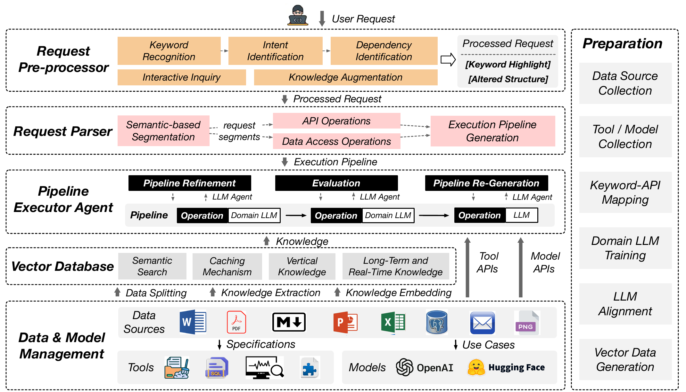

# 05 — Architecture LLMDB

> LLMDB s'articule autour de cinq composants complémentaires qui opèrent en deux temps : une phase offline de préparation (fine-tuning, embeddings, mappings) et une phase online d'inférence (pre-processing, parsing, exécution de pipeline).

---

## Ce que dit la slide

**Titre :** Les 5 composants de LLMDB

1. **General LLM** — compréhension du langage naturel, décomposition des requêtes
2. **Domain LLM** — fine-tuné sur les outils, APIs et schémas métier
3. **LLM Executor Agent** — génère, évalue et régénère les pipelines
4. **Vector Database** — cache sémantique des connaissances et résultats
5. **Data Source Manager** — unifie l'accès aux outils, modèles et données

Ces 5 composants opèrent en **2 temps** : préparation offline → inférence online.

---

## Concepts clés expliqués

### General LLM vs Domain LLM : rôles complémentaires

**General LLM :**
- Modèle de langage large, pré-entraîné sur un corpus généraliste (web, livres, code)
- Exemples : GPT-4, Claude 3, Llama 3.1-70B
- Forces : compréhension du langage naturel, décomposition de requêtes complexes, raisonnement général
- Faiblesses : hallucinations sur données de domaine, coût élevé, latence, peu de connaissance des schémas propriétaires

**Domain LLM (modèle de domaine) :**
- Modèle plus petit, fine-tuné sur des données du domaine : documentation des APIs, schémas de bases de données, logs d'incidents, requêtes SQL annotées
- Exemples dans l'écosystème DB : SQLCoder (Defog AI), Text2SQL-T5, custom fine-tunes de Llama
- Forces : précision sur les tâches de domaine, coût réduit (modèle plus petit), latence plus faible
- Faiblesses : moins de généralisabilité hors domaine, nécessite des données d'entraînement de qualité

**Complémentarité :** Dans LLMDB, le General LLM est utilisé pour comprendre l'intention de l'utilisateur et décomposer la requête en opérations de haut niveau. Le Domain LLM est utilisé pour exécuter les opérations qui requièrent une connaissance précise du domaine (ex. générer la bonne requête SQL, identifier la bonne API). Cette division du travail est analogue à la distinction entre un chef de projet (vision générale) et des experts techniques (exécution précise).

### Fine-tuning : principe (rappel concis)

Le **fine-tuning** consiste à prendre un LLM pré-entraîné et à continuer son entraînement sur un corpus plus petit et plus ciblé, pour adapter ses poids à un domaine spécifique.

```
Pré-entraînement (général) : 300B tokens, web + livres + code
       ↓
Fine-tuning (domaine) : 10K-1M paires (requête NL, pipeline attendu)
       ↓
Domain LLM spécialisé
```

Le fine-tuning modifie (une partie des) poids du modèle pour que la distribution de sortie soit plus proche du domaine cible. Contrairement au prompting, les connaissances sont **encodées dans les poids** et pas réinjectées à chaque appel — avantage en coût et en latence à l'inférence. [Détail complet : voir slide 06](slide-06-preparation.md)

### LLM Executor Agent : analogie chef de projet

Le **LLM Executor Agent** est le composant d'orchestration central. Ses responsabilités :

1. **Recevoir** la requête parsée (séquence d'opérations abstraites)
2. **Générer** le pipeline d'exécution concret (quels outils appeler, dans quel ordre, avec quels paramètres)
3. **Exécuter** chaque étape du pipeline via le Data Source Manager
4. **Évaluer** le résultat de chaque étape (vérification de cohérence, format, valeur attendue)
5. **Régénérer** uniquement les étapes défaillantes si nécessaire

**Analogie chef de projet :** Le General LLM comprend le besoin du client (utilisateur). L'Executor Agent est le chef de projet qui décompose le travail en tâches, les assigne aux bons prestataires (outils, API, modèles spécialisés via le DSM), vérifie les livrables, et ne relance que les sous-traitants défaillants.

### Vector Database : structure, embeddings et trois rôles dans LLMDB

**Qu'est-ce qu'une Vector Database ?**

Une base de données vectorielle stocke et indexe des vecteurs d'embedding à haute dimension (typiquement 768 à 4096 dimensions). Elle permet des recherches par **similarité sémantique** (nearest-neighbor search) plutôt que par correspondance exacte.

**Construction d'un embedding :**
```
Texte : "Calcule la capacité moyenne des hôpitaux de Toronto"
       → Modèle d'embedding (ex: sentence-transformers, text-embedding-ada-002)
       → Vecteur ∈ R^1536 : [0.23, -0.87, 0.14, ..., 0.56]
```

**Algorithmes d'indexation :**
- **FAISS** (Facebook AI Similarity Search) : bibliothèque de référence pour la recherche de voisins approximatifs, optimisée CPU/GPU
- **HNSW** (Hierarchical Navigable Small World) : graphe hiérarchique permettant des recherches approximatives en O(log n)
- Produits commerciaux : Pinecone, Weaviate, Qdrant, ChromaDB (open source)

**Les trois rôles de la Vector DB dans LLMDB :**

| Rôle | Description | Utilisé en |
|---|---|---|
| 1. Enrichissement contextuel | Récupérer les connaissances pertinentes (incidents similaires, documentation, schémas) pour enrichir le prompt | Offline + Online |
| 2. Cache sémantique | Stocker les pipelines déjà résolus ; les requêtes similaires évitent un nouvel appel LLM | Online |
| 3. Apprentissage non-paramétrique | Accumuler de l'expérience sans réentraîner le modèle ; chaque requête résolue enrichit la base | Continu |

### Data Source Manager (DSM) : abstraction sur sources hétérogènes

Le **Data Source Manager** est le composant qui abstrait l'accès à toutes les sources de données et outils disponibles :

- **Bases de données** : PostgreSQL, MySQL, MongoDB, Cassandra, etc. (requêtes SQL ou NoSQL)
- **APIs externes** : Prometheus (métriques), Elasticsearch (logs), APIs REST métier
- **Modèles ML spécialisés** : modèles pré-entraînés pour des tâches spécifiques (ex. modèle de prédiction de charge, modèle de détection d'anomalies)
- **Fichiers** : CSV, Parquet, JSON, données tabulaires non-structurées

**Principe d'abstraction :** L'Executor Agent n'a pas besoin de connaître les détails de chaque source. Il demande au DSM : "récupère les métriques CPU des 5 dernières minutes" et le DSM sait comment interroger Prometheus avec la bonne requête PromQL.

Cette abstraction est critique pour la **généralisabilité** de LLMDB : pour ajouter une nouvelle source de données, on ajoute un connecteur dans le DSM sans modifier les autres composants.

### Interaction entre composants via la figure 2


*Figure 2 — Vue d'ensemble de l'architecture LLMDB avec les deux phases de fonctionnement*

La figure 2 illustre le flux d'information entre les composants :

**Phase Offline (en haut) :**
- Les données sources et outils sont catalogués
- Le Domain LLM est fine-tuné
- Les embeddings sont générés et indexés dans la Vector DB
- Les mappings keyword→API sont construits

**Phase Online (en bas) :**
- La requête utilisateur entre par le Pre-Processor
- Le General LLM (ou Domain LLM) parse la requête
- L'Executor Agent génère et exécute le pipeline
- Le DSM coordonne les appels aux sources de données
- La Vector DB est consultée pour l'enrichissement et le cache
- Le résultat remonte à l'utilisateur en langage naturel

---

## Pour aller plus loin

- La phase offline en détail : [voir slide 06](slide-06-preparation.md)
- La phase online en détail : [voir slide 07](slide-07-inference.md)
- Application aux cas d'usage : [voir slides 08](slide-08-diagnostic.md), [09](slide-09-analytics.md), [10](slide-10-sql-rewrite.md)

## Figures associées


*Figure 2 — Architecture complète de LLMDB, montrant les 5 composants et leur interaction en phases offline et online.*

---

## Questions d'examen possibles

1. **Définition :** Quels sont les 5 composants de LLMDB ? Décrivez brièvement le rôle de chacun.
2. **Comparaison :** En quoi le Domain LLM diffère-t-il du General LLM ? Quand utilise-t-on chacun ?
3. **Application :** Expliquez les trois rôles de la Vector Database dans LLMDB avec un exemple pour chaque rôle.
4. **Analyse :** Pourquoi le Data Source Manager est-il un composant central pour la généralisabilité du framework ?
5. **Synthèse :** Décrivez le flux complet d'une requête utilisateur à travers les 5 composants de LLMDB, en distinguant la phase offline et la phase online.
