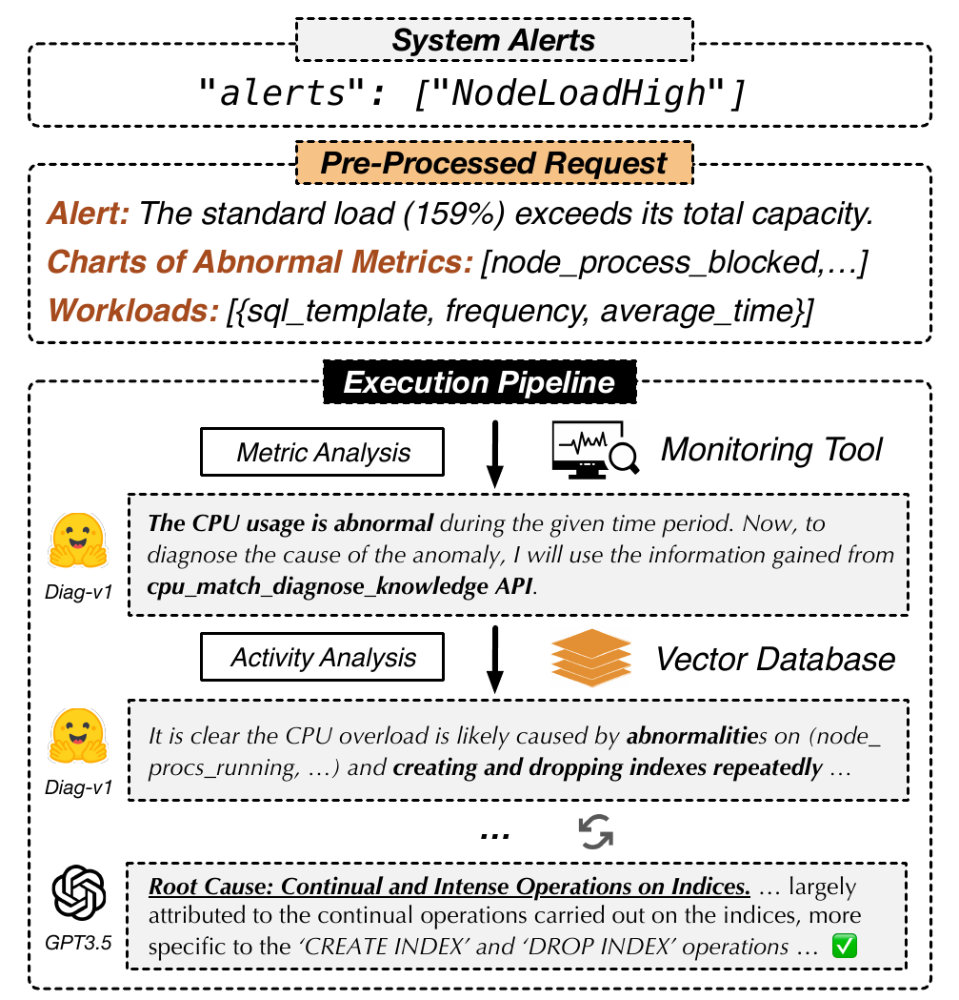

# 08 — Cas d'usage 1 : Diagnostic de base de données

> LLMDB automatise le diagnostic de BDD via un pipeline enrichissement → analyse métriques → analyse logs → matching knowledge base → recommandation, permettant de traiter des alertes complexes comme un DBA expert mais sans nécessiter des milliers de cas labellisés.

---

## Ce que dit la slide

**Titre :** Diagnostic BDD — *NodeLoadHigh à 159%* (Cas d'usage 1)

**Scénario :** Alerte `NodeLoadHigh` — charge CPU dépasse la capacité totale.

Pipeline LLMDB :
1. **Enrichissement** — complétion de l'alerte avec contexte (durée, processus, requêtes lentes)
2. **Pipeline** — analyse métriques → analyse logs → knowledge base → recommandation
3. **Résultat** — "La cause est une série de créations et suppressions d'index répétées sur les mêmes tables"

---

## Concepts clés expliqués

### Monitoring de bases de données : métriques clés

Pour diagnostiquer une BDD, les systèmes de monitoring collectent en continu des métriques système et applicatives :

**Métriques système :**

| Métrique | Description | Outil usuel |
|---|---|---|
| CPU utilization | % de temps CPU non-idle | Prometheus, Datadog |
| Load average | File d'attente de processus (1/5/15 min) | Unix `uptime`, `/proc/loadavg` |
| I/O wait | % CPU bloqué en attente I/O disque | `iostat`, `iotop` |
| Memory (RSS, swap) | Mémoire utilisée, utilisation swap | `free`, `vmstat` |
| Network throughput | Bande passante en/out | `netstat`, `iftop` |

**Métriques BDD (PostgreSQL/MySQL) :**

| Métrique | Description |
|---|---|
| Active connections | Nombre de connexions actives |
| Lock waits | Nombre et durée des verrous en attente |
| Slow queries | Requêtes dépassant un seuil de latence |
| Cache hit ratio | % de lectures servies depuis le buffer pool |
| Replication lag | Retard du réplica par rapport au primaire |
| Table/Index bloat | Espace mort dans les tables et index |
| DDL operations | Opérations CREATE/DROP/ALTER en cours |

### Load average Unix : interprétation précise

**Définition :** Le **load average** mesure le nombre moyen de processus en attente d'exécution (dans la run queue du scheduler) sur une fenêtre glissante de 1, 5 et 15 minutes.

**Formule d'interprétation :**

```
Load average "saturation" = load_average / nombre_de_cœurs_CPU
```

**Exemple du cas LLMDB :** `NodeLoadHigh à 159%`

Sur un serveur à 1 cœur CPU :
```
load_average = 1.59
saturation = 1.59 / 1 = 159% → le CPU est à 159% de sa capacité
```

Sur un serveur à 4 cœurs CPU :
```
load_average = 1.59
saturation = 1.59 / 4 = 39.75% → pas de problème
```

**La valeur absolue n'a de sens qu'en relation au nombre de cœurs.** L'alerte `NodeLoadHigh` dans LLMDB signifie que le load average dépasse le nombre de cœurs disponibles — il y a plus de processus en attente que de ressources pour les traiter.

**Ce qu'inclut le load average :** En Linux, le load average compte non seulement les processus en état R (running ou runnable) mais aussi les processus en état D (uninterruptible sleep, généralement en attente I/O). Un load average élevé peut donc indiquer soit une saturation CPU, soit une saturation I/O.

### Root Cause Analysis (RCA) : symptôme vs cause profonde

**Définition :** La **Root Cause Analysis** (analyse de cause racine) est le processus d'identification de la cause fondamentale d'un problème, au-delà des symptômes observables.

**Distinction symptôme / cause :**

```
Symptôme :  CPU à 159% → alerte NodeLoadHigh
Cause intermédiaire : processus mysqld consomme 90% CPU
Cause racine : série de CREATE INDEX / DROP INDEX répétées sur les mêmes tables
              → chaque opération DDL force une reconstruction complète de l'index
              → reconstruction = opération CPU-intensive + verrou exclusif sur la table
```

**Difficulté de la RCA avec causes corrélées :** Plusieurs causes peuvent être corrélées sans être causales. Exemple : une augmentation du trafic réseau coincide avec la charge CPU élevée, mais n'en est pas la cause — elles ont toutes deux été déclenchées par le même événement (job de maintenance planifié). Un modèle ML de corrélation identifierait faussement le trafic réseau comme cause.

**Avantage des LLMs pour la RCA :** Les LLMs peuvent raisonner sur des relations causales et distinguer corrélation et causalité, s'ils ont été entraînés sur des cas similaires. Ils peuvent également interroger dynamiquement les sources de données pertinentes pour valider ou infirmer des hypothèses.

### Pipeline de diagnostic LLMDB : déroulement détaillé


*Figure 3 — Pipeline LLMDB pour le diagnostic de base de données*

**Étape 1 : Enrichissement de l'alerte**

L'alerte brute `NodeLoadHigh` est enrichie avec :
- Durée de la surcharge (depuis quand ? combien de temps ?)
- Top processus consommateurs (quel processus ? quel PID ?)
- Requêtes SQL lentes en cours (slow query log)
- Opérations DDL actives
- Tendance historique (pic habituel ou anomalie ?)

Cet enrichissement est réalisé via des appels automatiques aux APIs de monitoring (Prometheus, slow query log) et au Vector DB (incidents similaires passés).

**Étape 2 : Analyse des métriques**

Le Domain LLM analyse les métriques enrichies :
- Identifie les métriques anormales (CPU, I/O, lock waits)
- Génère des hypothèses de cause intermédiaire
- Priorise les hypothèses par vraisemblance

**Étape 3 : Analyse des logs d'activité**

Le pipeline interroge les logs (slow query log, error log, audit log) pour valider ou infirmer les hypothèses :
- Y a-t-il des opérations DDL récentes ? → `grep "CREATE INDEX\|DROP INDEX" error.log`
- Y a-t-il des connexions massives récentes ?
- Y a-t-il des erreurs de verrous (lock timeout, deadlock) ?

**Étape 4 : Matching avec la knowledge base**

Les symptômes qualifiés sont comparés (similarité cosinus) avec les incidents historiques stockés dans la Vector DB :
- Incident similaire en 2023 : CPU élevé + DDL → reconstruction d'index répétée → résolution : suspension du job de maintenance

**Étape 5 : Recommandation**

Synthèse en langage naturel : "La cause est une série de créations et suppressions d'index répétées sur les mêmes tables. Recommandation : suspendre le job de maintenance `rebuild_indexes` et planifier ces opérations pendant les heures creuses."

### Comparaison avec ML classique pour le diagnostic

| Critère | ML supervisé classique | LLMDB |
|---|---|---|
| Données requises | Milliers d'incidents labellisés | Quelques dizaines d'exemples + documentation |
| Adaptation à de nouveaux types d'incidents | Réentraînement nécessaire | Enrichissement de la Vector DB |
| Explication | Label de classification (ex: "index issue") | Phrase explicative en NL |
| Métriques nouvelles | Non gérées si non vues en entraînement | Gérées via enrichissement contextuel |
| Expertise requise pour labelliser | DBA senior (coût élevé) | Modéré (vérification humaine des résultats) |

---

## Pour aller plus loin

- La phase online qui décrit le fonctionnement général du pipeline : [voir slide 07](slide-07-inference.md)
- Le défi des données multimodales pour le diagnostic : [voir slide 11](slide-11-defis.md)
- Le cas d'usage analytics qui partage le même moteur de pipeline : [voir slide 09](slide-09-analytics.md)

## Figures associées


*Figure 3 — Pipeline LLMDB pour le diagnostic de base de données : enrichissement de l'alerte, analyse des métriques et des logs, matching knowledge base, recommandation en NL.*

---

## Questions d'examen possibles

1. **Définition :** Qu'est-ce que le load average Unix ? Comment interpréter une valeur de 159% sur un serveur monocœur vs quadricœur ?
2. **Comparaison :** Distinguez symptôme et cause racine dans le cas `NodeLoadHigh`. Pourquoi la RCA est-elle plus difficile que la détection d'anomalies ?
3. **Processus :** Décrivez les 5 étapes du pipeline de diagnostic LLMDB pour l'alerte `NodeLoadHigh`.
4. **Analyse :** Quels avantages LLMDB présente-t-il par rapport à une approche ML supervisée pour le diagnostic de BDD ?
5. **Application :** Comment la Vector DB intervient-elle dans le diagnostic ? À quelles étapes est-elle sollicitée ?
