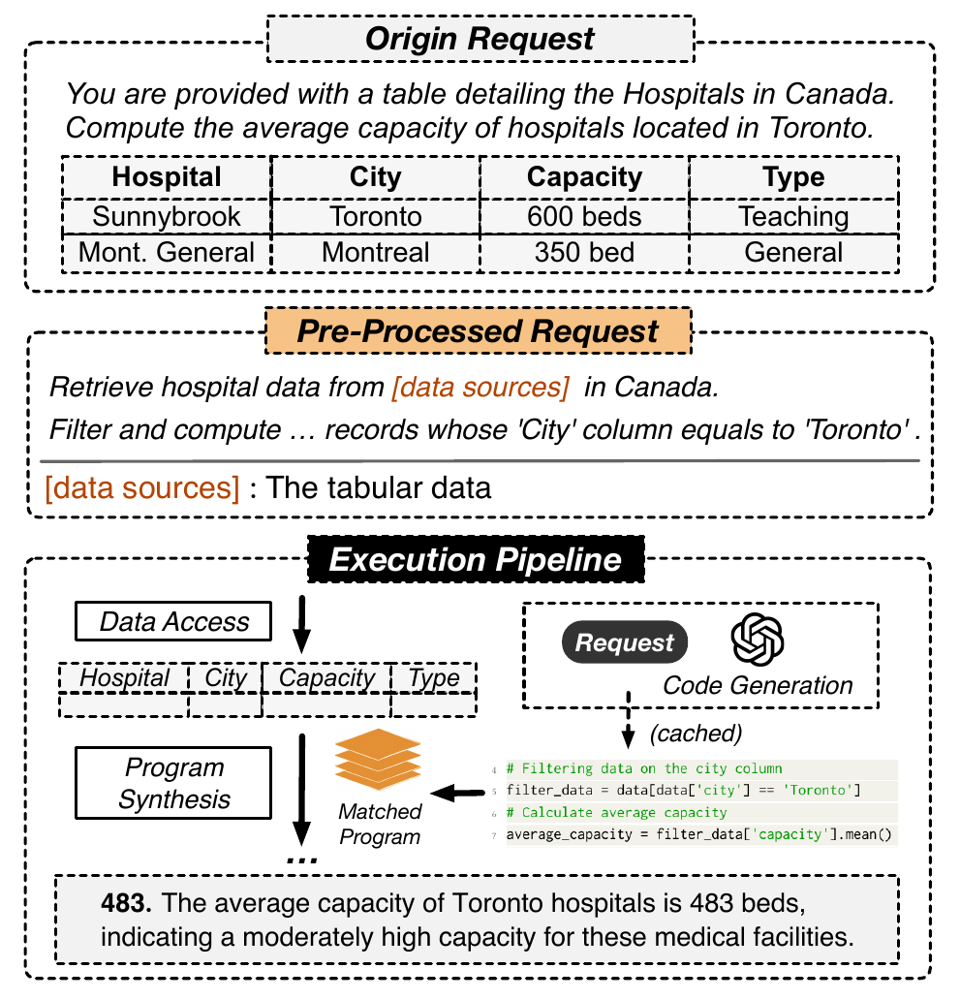

# 09 — Cas d'usage 2 : Data Analytics en langage naturel

> LLMDB permet à un utilisateur non-technicien d'interroger un dataset en langage naturel (Text-to-Pandas/SQL), génère le code d'exécution correspondant, et enrichit progressivement sa Vector DB pour accélérer les requêtes similaires futures.

---

## Ce que dit la slide

**Titre :** Data Analytics en langage naturel (Cas d'usage 2)

**Scénario :** *"Calcule la capacité moyenne des hôpitaux de Toronto"* — utilisateur non-technicien, dataset hôpitaux canadiens.

Pipeline LLMDB :
1. **Préparation** — chargement et nettoyage des données tabulaires
2. **Parsing** — traduction NL → pipeline d'opérations API
3. **Génération de code** — production d'un script Pandas exécutable
4. **Résultat + cache** — `La capacité moyenne des hôpitaux de Toronto est de 483 lits`

---

## Concepts clés expliqués

### Text-to-SQL vs Text-to-Pandas

Deux approches existent pour interroger des données tabulaires en langage naturel :

**Text-to-SQL :**
- Cible : bases de données relationnelles (PostgreSQL, MySQL, SQLite)
- Sortie : requête SQL exécutable
- Avantages : expressivité de SQL (jointures complexes, fenêtres, agrégations), moteur optimisé
- Limites : pas adapté aux transformations complexes (ML, visualisation, nettoyage avancé)

**Benchmarks de référence :**
- **Spider** (Yale, 2019) : 10 000 questions NL sur 200 bases de données, accent sur la généralisation inter-domaines
- **WikiSQL** (Salesforce, 2017) : 80 000 questions NL sur des tables Wikipedia, modèle plus simple (pas de jointures)

**Text-to-Pandas :**
- Cible : DataFrames Python (fichiers CSV, Parquet, données en mémoire)
- Sortie : code Python Pandas exécutable
- Avantages : flexibilité maximale (transformations arbitraires, intégration ML, visualisation matplotlib/seaborn)
- Limites : moins standard que SQL, moins optimisé pour les très grandes tables

**Choix dans LLMDB :** Text-to-Pandas est privilégié pour l'analytics car il s'intègre naturellement avec l'écosystème Python et permet des opérations que SQL ne supporte pas nativement (ex. appliquer un modèle de ML, générer un graphique, déduplication avancée).

### Déroulement complet de la requête analytique

**Requête :** "Calcule la capacité moyenne des hôpitaux situés à Toronto"

**Étape 1 : Préparation (chargement + nettoyage)**

Le Data Source Manager charge le fichier de données :
```python
df = pd.read_csv("hospitals_canada.csv")
```

Nettoyage automatique appliqué par le Domain LLM :
```python
# Standardisation des dates
df['date_ouverture'] = pd.to_datetime(df['date_ouverture'])

# Suppression des doublons
df = df.drop_duplicates(subset=['hospital_id'])

# Normalisation des noms de villes (variantes : "Toronto", "toronto", "TORONTO")
df['city'] = df['city'].str.title()

# Suppression des lignes avec capacité manquante
df = df.dropna(subset=['capacity'])
```

Le nettoyage est semi-automatique : le Domain LLM détecte les problèmes courants à partir d'une analyse du schéma et d'un échantillon des données.

**Étape 2 : Parsing NL → opérations**

Via SRL ([voir slide 07](slide-07-inference.md)) :
```
FILTRER les hôpitaux par ville = "Toronto"
CALCULER la MOYENNE de la colonne "capacity"
```

**Étape 3 : Génération de code Pandas**

Le Domain LLM génère le script exécutable :
```python
result = df[df['city'] == 'Toronto']['capacity'].mean()
print(f"La capacité moyenne des hôpitaux de Toronto est de {result:.0f} lits")
```

**Étape 4 : Exécution et résultat**

```
La capacité moyenne des hôpitaux de Toronto est de 483 lits
```

Le résultat est formaté en langage naturel et présenté à l'utilisateur.

### Cache sémantique progressif : apprentissage sans réentraînement

Le cas de l'analytics illustre parfaitement le mécanisme de **cache sémantique progressif**.

**Fonctionnement :**

Après la première exécution réussie :
```
Requête : "Calcule la capacité moyenne des hôpitaux de Toronto"
Pipeline résolu : [filter(city="Toronto"), mean(capacity)]
Embedding : e1 = encode("Calcule la capacité moyenne des hôpitaux de Toronto")
Stockage Vector DB : (e1, pipeline_résolu, résultat)
```

Requête future similaire :
```
Requête 2 : "Quelle est la capacité moyenne des hôpitaux toronto ?"
Embedding : e2 = encode(requête 2)
Similarité cosinus : cos_sim(e1, e2) = 0.94 > seuil → HIT sémantique
Action : adapter le pipeline résolu (ajustement minimal si nécessaire)
Résultat : retourné sans appel LLM
```

Requête partiellement similaire :
```
Requête 3 : "Calcule la capacité moyenne des hôpitaux de Montréal"
Embedding : e3 = encode(requête 3)
Similarité cosinus : cos_sim(e1, e3) = 0.82 > seuil partiel → HIT partiel
Action : réutiliser le pipeline en modifiant uniquement le filtre (city="Montréal")
Résultat : pipeline partiellement mis en cache, nouveau calcul pour Montréal
```

**Accumulation d'expérience :**
```
Après N requêtes :
Vector DB : { (e_Toronto, pipeline_Toronto), (e_Montréal, pipeline_Montréal),
              (e_Vancouver, pipeline_Vancouver), ... }
Nouvelles requêtes : HIT de plus en plus fréquents
Coût LLM : décroissant avec le volume de requêtes
```

Ce mécanisme réalise un **apprentissage non-paramétrique continu** : le système s'améliore avec l'usage sans modifier les poids du modèle (contrairement au réentraînement).

### Valeur métier : accessibilité aux non-experts

**Avant LLMDB :**
- Analyste data : SQL ou Python requis
- Manager business : dépend d'un analyste (délai, coût)
- Ad hoc analysis : 1-2 jours pour une requête simple

**Avec LLMDB :**
- Manager business : pose la question en français → résultat en secondes
- Analyste data : se concentre sur des analyses plus complexes
- Réduction du temps de cycle d'analyse : de jours à secondes pour les requêtes standard

**Cas d'usage Big Data :**

Sur des volumes importants (milliards de lignes), la génération de code optimisé par le Domain LLM peut produire des requêtes qui exploitent des optimisations Pandas (chunking, vectorisation, groupby optimisé) que l'utilisateur non-expert n'aurait pas pensé à utiliser.

### Limites du cas d'usage analytics

**Formats hétérogènes :** Un dataset réel peut mélanger des colonnes avec des formats incohérents (dates en DD/MM/YYYY vs MM-DD-YYYY, nombres en "1,234.56" vs "1.234,56"). Le Domain LLM doit détecter et normaliser ces variations — un défi ouvert discuté dans les défis. [voir slide 11](slide-11-defis.md)

**Ambiguïté sémantique :** "Capacité" peut signifier capacité autorisée, capacité actuelle, capacité installée — sans précision dans le schéma, le LLM doit deviner ou demander une clarification (Human-in-the-Loop).

---

## Pour aller plus loin

- Mécanisme du cache sémantique expliqué dans le contexte du framework général : [voir slide 04](slide-04-llmdb.md)
- La phase d'inférence (SRL, Parser, Agent) qui sous-tend ce pipeline : [voir slide 07](slide-07-inference.md)
- Les défis spécifiques à l'analytics : [voir slide 11](slide-11-defis.md)

## Figures associées



*Figure 4 — Pipeline LLMDB pour l'analytics en langage naturel : préparation des données, parsing NL→opérations, génération de code Pandas, exécution et mise en cache.*

---

## Questions d'examen possibles

1. **Comparaison :** Quelles sont les différences entre Text-to-SQL et Text-to-Pandas ? Dans quel contexte préférer l'un ou l'autre ?
2. **Processus :** Décrivez les 4 étapes du pipeline analytics LLMDB pour la requête "Calcule la capacité moyenne des hôpitaux de Toronto".
3. **Mécanisme :** Expliquez le cache sémantique progressif. Comment permet-il un apprentissage sans réentraînement ?
4. **Application :** Donnez un exemple de requête qui bénéficierait d'un HIT sémantique partiel (réutilisation d'un pipeline existant avec adaptation minimale).
5. **Analyse :** Quelles sont les deux principales limites du cas d'usage analytics ? Comment LLMDB tente-t-il de les adresser ?
