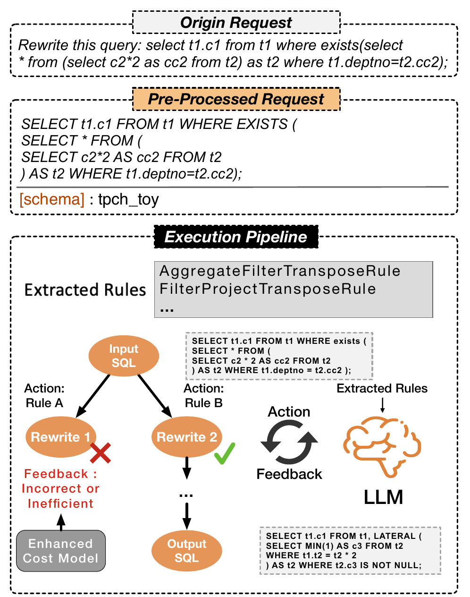

# 10 — Cas d'usage 3 : Réécriture automatique de requêtes SQL

> LLMDB automatise la réécriture SQL en extrayant des règles de transformation depuis la littérature, en les appliquant à la requête cible, puis en sélectionnant la réécriture qui est à la fois sémantiquement équivalente et moins coûteuse selon le query optimizer.

---

## Ce que dit la slide

**Titre :** Réécriture automatique de requêtes SQL (Cas d'usage 3)

**Problème :** Une requête SQL *correcte* peut être inefficace — la réécrire manuellement requiert une expertise avancée.

Pipeline LLMDB :
1. **Extraction de règles** — depuis manuels de BDD et papiers de recherche
2. **Application** — sélection des règles applicables + génération de candidats réécrits
3. **Évaluation** — équivalence sémantique + coût d'exécution estimé
4. **Sélection** — la réécriture optimale est retournée

---

## Concepts clés expliqués

### Query optimizer : plan d'exécution et coût estimé

**Le problème de l'optimisation de requêtes :**

Pour exécuter `SELECT ... FROM A JOIN B WHERE ...`, le SGBD a plusieurs stratégies possibles :
- Joindre A et B avant de filtrer, ou filtrer d'abord
- Utiliser un Hash Join, un Nested Loop Join, ou un Merge Join
- Utiliser un index sur A, sur B, ou aucun
- Lire les données en mémoire tampons ou séquentiellement

Le nombre de plans possibles croît exponentiellement avec le nombre de tables : pour N tables, il y a O(N!) ordres de jointure.

**Le query optimizer** explore (partiellement) cet espace et estime le coût de chaque plan via des statistiques :
- Cardinalité estimée des tables (nombre de tuples)
- Sélectivité estimée des prédicats (fraction de tuples satisfaisant une condition WHERE)
- Coût I/O et CPU de chaque opérateur physique

**`EXPLAIN` / `EXPLAIN ANALYZE` :**

```sql
EXPLAIN SELECT AVG(h.capacity)
FROM hospitals h
WHERE h.city = 'Toronto';

-- Sortie :
Aggregate  (cost=125.50..125.51 rows=1 width=4)
  -> Seq Scan on hospitals  (cost=0.00..124.00 rows=600 width=4)
        Filter: (city = 'Toronto')
```

Le coût estimé (125.51) est une unité arbitraire basée sur les I/O. Un plan avec un coût plus faible est généralement plus rapide.

**Limite du query optimizer :** L'optimizer travaille sur la requête telle qu'elle est écrite. Il ne peut pas transformer la sémantique de la requête — il peut choisir le meilleur *plan* pour *cette* requête, mais pas réécrire la requête pour qu'elle soit intrinsèquement moins coûteuse.

### Règles de réécriture SQL classiques

Les règles de réécriture transforment une requête SQL en une requête sémantiquement équivalente mais plus efficace.

**FilterProjectTransposeRule :** Pousser les filtres (`WHERE`) le plus tôt possible dans le plan d'exécution, avant les projections (`SELECT`) et les jointures.

```sql
-- Avant (inefficace : calcule l'expression sur toutes les lignes avant de filtrer)
SELECT UPPER(name), capacity
FROM hospitals
WHERE UPPER(name) LIKE '%TORONTO%';

-- Après (plus efficace si index sur name)
SELECT UPPER(name), capacity
FROM hospitals
WHERE name ILIKE '%toronto%';
```

**AggregateFilterTransposeRule :** Pousser un filtre à travers une agrégation quand c'est possible (correspond au remplacement d'un `HAVING` par un `WHERE` pré-agrégation).

```sql
-- Avant (agrège tous les tuples, puis filtre)
SELECT city, AVG(capacity) as avg_cap
FROM hospitals
GROUP BY city
HAVING city = 'Toronto';

-- Après (filtre d'abord, réduit les données avant l'agrégation)
SELECT city, AVG(capacity) as avg_cap
FROM hospitals
WHERE city = 'Toronto'
GROUP BY city;
```

**Élimination de sous-requêtes corrélées :** Les sous-requêtes corrélées sont ré-exécutées pour chaque tuple de la requête externe → O(N²). Les réécrire en JOIN est souvent O(N log N).

```sql
-- Avant (sous-requête corrélée : O(N²))
SELECT h.name
FROM hospitals h
WHERE h.capacity > (SELECT AVG(h2.capacity)
                    FROM hospitals h2
                    WHERE h2.city = h.city);

-- Après (JOIN avec agrégation pré-calculée : O(N log N))
SELECT h.name
FROM hospitals h
JOIN (SELECT city, AVG(capacity) as avg_cap
      FROM hospitals
      GROUP BY city) city_avg
ON h.city = city_avg.city
WHERE h.capacity > city_avg.avg_cap;
```

**LATERAL JOIN :** Exemple mentionné dans la présentation. Un `LATERAL` permet à une sous-requête de référencer des colonnes de tables précédentes dans le `FROM`.

```sql
-- Avant (subquery imbriquée)
SELECT h.name, recent.last_incident
FROM hospitals h,
     (SELECT incident_date as last_incident
      FROM incidents
      WHERE hospital_id = h.id
      ORDER BY incident_date DESC LIMIT 1) recent;

-- Après (LATERAL JOIN : plus lisible et souvent optimisable par le moteur)
SELECT h.name, recent.last_incident
FROM hospitals h,
LATERAL (SELECT incident_date as last_incident
         FROM incidents
         WHERE hospital_id = h.id
         ORDER BY incident_date DESC LIMIT 1) recent;
```

### Pipeline LLMDB pour la réécriture SQL


*Figure 5 — Pipeline LLMDB pour la réécriture automatique de requêtes SQL*

**Étape 1 : Extraction de règles**

Le General LLM lit des sources textuelles :
- Manuels des SGBDs (PostgreSQL docs, MySQL Reference)
- Papiers de recherche (ex. "QB4Spark", "WeTune", "LearnedRewrite")
- Blogs techniques de DBA

Il extrait des règles de transformation sous forme structurée :
```
Règle AggregateFilterTranspose :
  Pattern : SELECT ... GROUP BY ... HAVING col = valeur
  Réécriture : SELECT ... WHERE col = valeur ... GROUP BY ...
  Condition : la colonne de HAVING doit être une colonne de groupement (pas une agrégation)
  Gain estimé : filtrage avant agrégation réduit les données traitées
```

Ces règles sont stockées dans la Vector DB pour une recherche sémantique lors de l'application.

**Étape 2 : Application des règles**

Pour une requête cible donnée :
1. Analyse syntaxique de la requête (AST : Abstract Syntax Tree)
2. Recherche sémantique dans la Vector DB pour trouver les règles applicables (similarité entre la structure de la requête et les patterns des règles)
3. Application des règles candidates pour générer plusieurs variantes réécrites

**Étape 3 : Évaluation — équivalence sémantique**

**Vérification formelle :** Démonstration par l'algèbre relationnelle que les deux requêtes sont équivalentes (même résultat pour toute instance de base de données). Outils : U-semiring (Khamis et al.), SMT solvers.

```
∀D, Q_original(D) = Q_réécrit(D)
```

**Vérification empirique :** Exécuter les deux requêtes sur un échantillon de données et comparer les résultats.

**Limites :** La vérification formelle est indécidable en général (NP-hard pour SQL complet). Des outils pratiques couvrent des sous-ensembles de SQL :
- Pas de garantie pour les requêtes avec NULL (logique trivaluée)
- DISTINCT crée des cas particuliers (élimination de doublons change le comportement)
- Fonctions non-déterministes (RANDOM(), NOW()) impossibles à vérifier formellement

**Évaluation du coût d'exécution :**

```sql
EXPLAIN Q_réécrit → coût estimé par l'optimizer
```

Si coût_réécrit < coût_original ET équivalence_vérifiée → la réécriture est acceptée.

**Étape 4 : Sélection**

La réécriture avec le meilleur gain de coût parmi les candidates validées est retournée. Si plusieurs réécritures sont équivalentes en coût, la plus simple (moins de tokens SQL) est préférée pour la lisibilité.

### Cas particuliers difficiles

**NULL :** SQL utilise une logique trivaluée (TRUE, FALSE, NULL). `NULL = NULL` est NULL (pas TRUE), ce qui rend les comparaisons complexes. Une réécriture valide pour des données non-NULL peut produire des résultats différents en présence de NULL.

**DISTINCT :** Une réécriture qui élimine un `DISTINCT` n'est valide que si la jointure ne crée pas de doublons — ce qui dépend des contraintes d'intégrité (clés étrangères) que l'optimizer doit connaître.

**Fonctions d'agrégation imbriquées :** `MAX(AVG(...))` n'est pas directement manipulable par les règles standard sans décomposition préalable.

Ces cas sont présentés comme des défis ouverts dans la slide 11. [voir slide 11](slide-11-defis.md)

---

## Pour aller plus loin

- La phase d'inférence qui applique ce pipeline : [voir slide 07](slide-07-inference.md)
- Les défis de vérification formelle : [voir slide 11](slide-11-defis.md)
- La Vector DB qui stocke les règles extraites : [voir slide 05](slide-05-architecture.md)

## Figures associées


*Figure 5 — Pipeline LLMDB pour la réécriture de requêtes SQL : extraction de règles depuis la littérature, application aux requêtes candidates, évaluation (équivalence + coût), sélection de la réécriture optimale.*

---

## Questions d'examen possibles

1. **Définition :** Qu'est-ce qu'un query optimizer ? Quelle est la différence entre l'optimisation de plan et la réécriture de requêtes ?
2. **Application :** Réécrivez la requête suivante en appliquant AggregateFilterTransposeRule : `SELECT city, COUNT(*) FROM employees GROUP BY city HAVING city = 'Paris'`
3. **Analyse :** Pourquoi la vérification formelle de l'équivalence sémantique est-elle difficile en général ? Quels cas particuliers posent problème ?
4. **Processus :** Décrivez les 4 étapes du pipeline LLMDB pour la réécriture SQL. Quelle étape est la plus critique, et pourquoi ?
5. **Comparaison :** En quoi l'approche LLMDB pour la réécriture SQL diffère-t-elle d'un optimizer traditionnel comme celui de PostgreSQL ?
